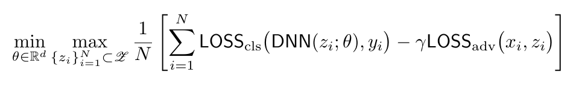
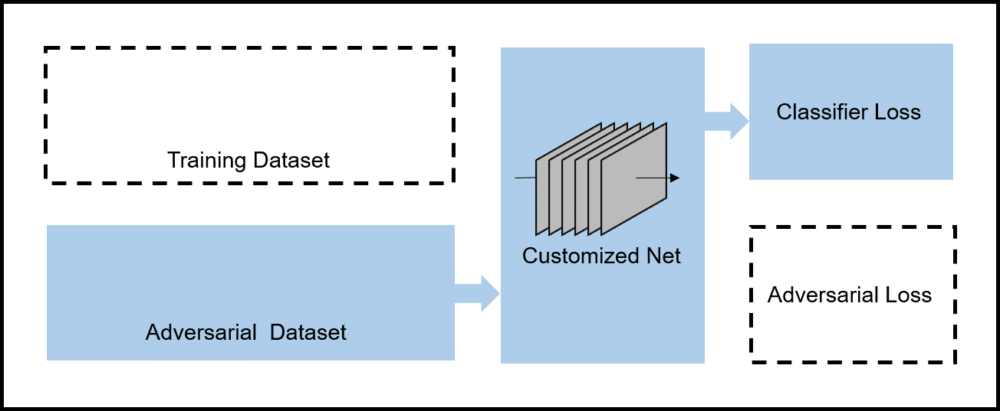
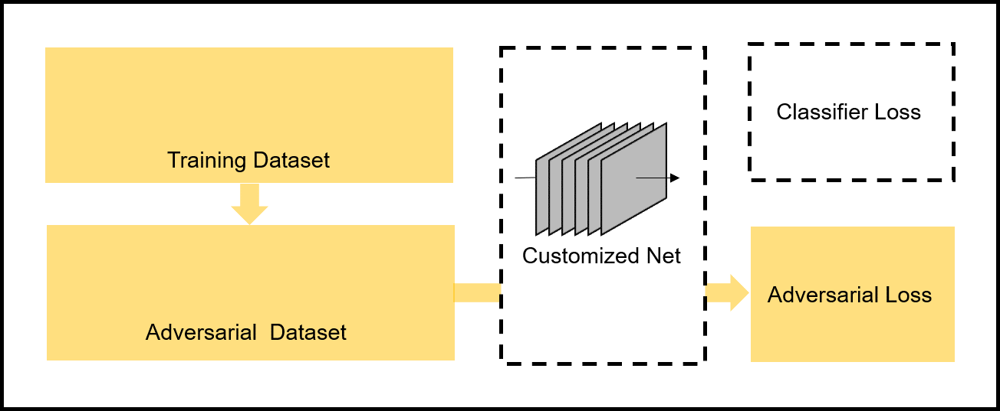

# A PyTorch Implementation of Wasserstein Robust Model
This repo provides the PyTorch implementation of the classical **Wasserstein robust model** which is theoretically analyzed in [[1]](#1). It generates the adversarial attacking data to improve the robustness of training model. Given the data set `(x, y)` where `x` is the image and `y` is the label, The goal of Wasserstein robust model is to solve the following optimization problem:
<p align="center">
    
</p>


Here `z` denotes the adversarial images and `theta` denotes the parameters of deep neural network. `gamma` is a tuning parameter to assure the maximization problem to be strongly concave. 


This PyTorch implementation of Wasserstein robust model aims to provides the flexibility of

* customizing the optimizer and the attacking strategy;

* utilizing the training history to boost up the speed of training. 


## Framework

This repo includes the following parts:

* A highly customizable PyTorch adversarial training pipeline.  
* A tutorial example on multiple datasets.

We illustrate the training pipeline as follows. 


For the first step, we do one step stochastic gradient descent with respect to `theta` (or other optimization method) on the neural network parameter by minimizing the *classifier loss*.
<p align="center">
    
</p>


For the second step, we do multiple steps stochastic gradient ascent with respect to `z` to perturb the original images. This approach is trying to maximize the classification error (adversarial attack)  under the soft constraint provided by the adversarial loss. 
<p align="center">
    
</p>


## Experiment Results
We present two demo examples showing the performance improvment is obtained by applying the momentum technique for both maximization and minimization stages. The supporting theory for full gradient updates is provided in [[2]](#2). To repeat the experiment, simply run
```
python train_MNIST.py
python train_FashionMNIST.py
```

<p align="center">
  
    
</p>


The repeating experiments on the paper [[2]](#2) is provided in the .7z file `GDA with Momentum - MNIST.7z`.

## Citation
To cite this repo:
```
@misc{wrm,
  title = {A PyTorch Implementation of Wasserstein Robust Model},
  author = {Shaocong Ma},
  year = {2021},
  publisher = {GitHub},
  journal = {GitHub repository},
  howpublished = {\url{https://github.com/mshaocong/wasserstein_robust_model}},
}
```
To cite our work:
```
@article{chen2021accelerated,
  title={Accelerated Proximal Alternating Gradient-Descent-Ascent for Nonconvex Minimax Machine Learning},
  author={Chen, Ziyi and Ma, Shaocong and Zhou, Yi},
  journal={arXiv preprint arXiv:2112.11663},
  year={2021}
}
```


## References

<a id="1">[1]</a> Sinha, Aman, et al. "Certifying some distributional robustness with principled adversarial training." *arXiv preprint arXiv:1710.10571* (2017).

<a id="2">[2]</a> Chen, Ziyi, et al. “Accelerated Proximal Alternating Gradient-Descent-Ascent for Nonconvex Minimax Machine Learning.” *arXiv preprint arXiv:2112.11663* (2021). 


